<div align="center">

<a href="https://alt-tab.app/"></a>

<a href="https://jb.gg/OpenSource"></a>

</div>

This fork adds a GitHub Action workflow that builds an unsigned version of Alt-Tab with Pro features enabled for free.

Since the app is self-signed you'll need tell your mac it's fine:

```sh
xattr -dr com.apple.quarantine "$HOME/Downloads/AltTab.app"
```

